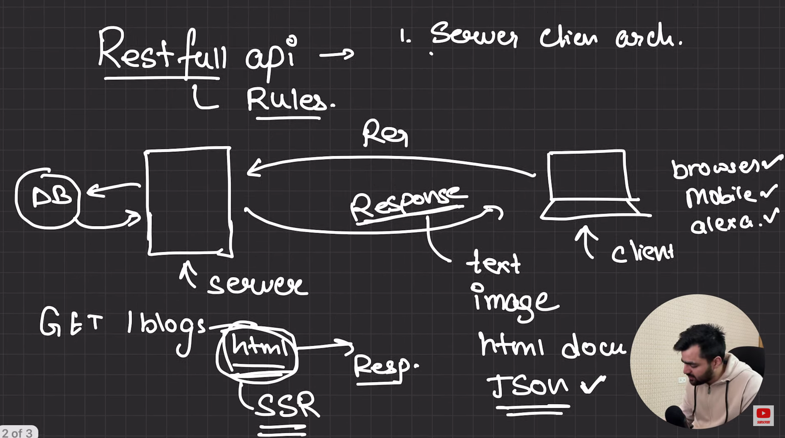
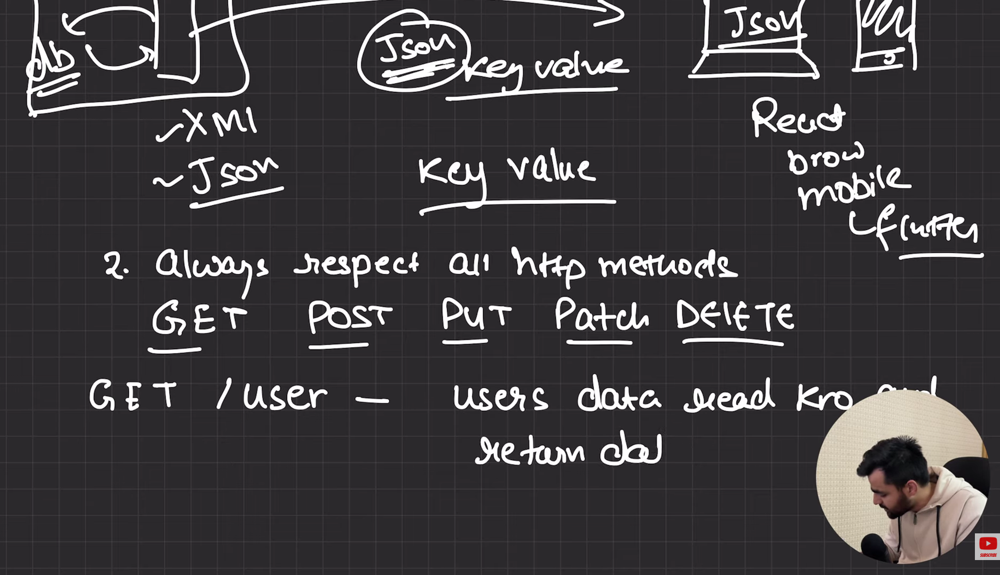
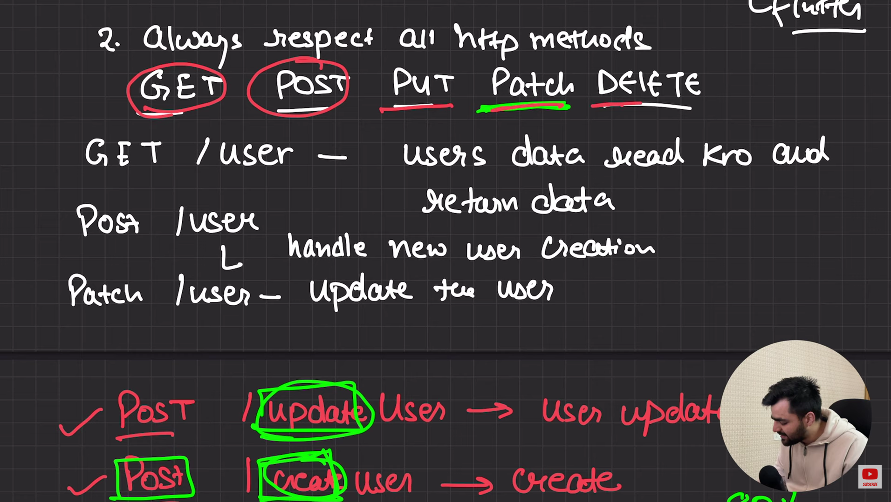
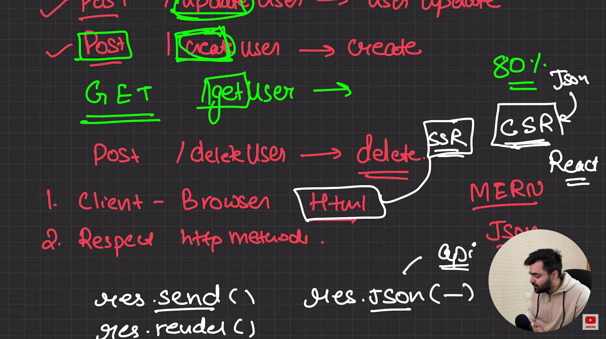

# Restfull API Rules

1. Works on server client architecture.

 

2. Always Respect All Http methods.
    Get , Post , Put , Delete

    Get /user - user data read kro and return kro

    Post /user - handle new user creation

    Pathch /user - Update the user

 

